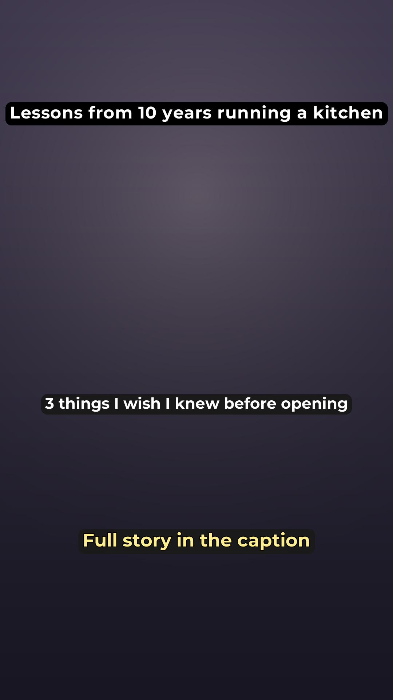

# Instagram + TikTok Content Agent

A working pipeline for producing short-form video content with an AI coding
agent. You bring a niche, some source material, and your own footage. It
renders the videos, writes the captions, and posts them through Postiz.

You drive it by talking to [Claude Code](https://claude.com/claude-code) or
[Codex](https://openai.com/codex) inside the repo folder. Say "make 3 vids" and
it produces three finished Reels for review. The rules that keep it on the
rails, what it may claim, what it may never invent, how every frame is checked
before upload, all live in `AGENTS.md` and `playbook.md`, which both tools read
automatically.

<p align="center">
  
</p>

<p align="center"><em>A frame straight out of the pipeline. Your own footage
plays behind the text; the gradient here stands in for it.</em></p>

## Start here

Install [Claude Code](https://claude.com/claude-code). Open it, and paste this
one line:

```
Clone https://github.com/junlee0703/Insta-tiktok-agent.git, read its AGENTS.md, and walk me through setting it up.
```

That is the whole setup. It downloads the code, installs anything missing,
connects your Instagram, and asks you about your channel in plain language. It
writes every config file for you, so you never edit one by hand, and it will
not post anything while setting up.

When it says setup is clean, say:

```
make 1 vid
```

You will see the exact words before anything goes live.

### What you need first

The setup can do everything except these three, so have them ready:

- **A Postiz account with an Instagram business account connected.** A personal
  Instagram cannot be posted to. Switching to business is free and takes a
  minute in the Instagram app settings.
- **Your own background footage.** A few short clips of you working, walking,
  sitting, whatever suits your topic. Ordinary phone video is right. Polished is
  not the goal. If you want TikTok too, some candid photos as well.
- **Something to say.** Notes, documents, or PDFs about your subject. The agent
  will not invent facts, so with an empty `knowledge/` folder it stops and asks
  instead of making something up.

Those last two are the actual work. Setup takes fifteen minutes; filming
footage and writing down what you know takes a weekend. That is the honest
tradeoff.

## What is included

- **Rendering** — 1080x1920 Reels and TikTok photo carousels, text overlays
  with per-line highlight boxes, auto-cropping, bundled fonts
- **Fair rotation** — least-used-first pickers for clips and photos, so your
  library gets used evenly instead of the same three shots every time
- **Publishing** — Postiz upload, scheduling, music attachment, state
  verification
- **Failure detection** — posts fail silently into `ERROR` more often than you
  would expect, and nothing notifies you. A cron script catches it.
- **Guardrails** — every factual claim must trace to a file you provide, and
  the agent stops and asks rather than inventing one

## What is not included

No niche, no brand, no content, no accounts. Specifically: `knowledge/`,
`clips/`, `photos/rotation/`, and the style guides all ship empty, and there
are no connected integrations. That part is yours.

## Requirements

If you used the one-line setup above, skip this. The agent installs these for
you.

- macOS or Linux
- Python 3.9+ and the packages in `scripts/requirements.txt`
- `ffmpeg` and `ffprobe`. The requirements file installs a bundled ffmpeg as a
  fallback, but the TikTok workflow extracts a frame with the CLI, so install
  it properly if you want TikTok.
- `jq`
- A [Postiz](https://postiz.com) account with your Instagram business account
  connected, plus the `postiz` CLI
- Claude Code or Codex

Postiz authenticates with `postiz auth:login`, an OAuth device flow. There are
no API keys to paste and no `.env` file to fill in.

## Setup by hand

The one-line path above is the same thing done for you. Run it yourself if you
would rather:

```bash
git clone https://github.com/junlee0703/Insta-tiktok-agent.git
cd Insta-tiktok-agent
pip install -r scripts/requirements.txt
postiz auth:login
python3 scripts/check_setup.py
```

`check_setup.py` tells you exactly what is still missing and keeps telling you
until nothing is. Work through it in this order:

1. **Fill in [brand.md](brand.md).** Every setting you own lives there: Postiz
   integration IDs, posting schedule, topic scope, fixed CTA wording, and the
   autopilot switch. Run `postiz integrations:list` to get your ID.
2. **Add source material to `knowledge/`.** Markdown, text, or PDF. This is the
   only thing the agent may draw facts from, so an empty folder means no
   content. See `knowledge/README.md`.
3. **Add background footage to `clips/`** and seed one entry per filename in
   `clips/clips_usage.json`.
4. **For TikTok, add photos to `photos/rotation/`** with a position entry each
   in `photos/rotation_positions.json`. Skip this if you only want Reels.
5. **Fill in `instagram/style_guide.md`** — who is speaking, who they are
   speaking to, and why they have standing on the topic. The agent refuses to
   invent a persona, so it will stop here if you leave it blank.

The full checklist also lives at the bottom of `playbook.md`.

## Daily use

Open the folder in Claude Code or Codex and talk to it:

- **"make 3 vids"** — picks topics from your `knowledge/`, writes the on-screen
  text and captions, shows them for approval, then renders and publishes all
  three
- **"change the second caption to ..."** — revise before approving
- **"check my posts"** — verifies nothing failed silently

Run `scripts/post_health_cron.sh` on a cron schedule to catch failures without
having to remember.

## How approval works

**Posts are real and public. The one thing you approve is the copy.**

Say "make 3 vids" and the agent writes the on-screen text and captions for all
three, then shows them to you in the chat and stops:

```
Reel 1 — 7:00 AM
  Title:     <the credibility-led line that goes on screen>
  On screen: <the numbered statement>
  Caption:   <the full caption, ending in your CTA>
```

Edit the wording as much as you like. Once you say go, it renders the videos,
checks every frame, uploads, and publishes all three as real public posts
without asking again. There are no drafts sitting in Postiz to go clean up.

If you want it to skip even the copy approval, set `autopilot: on` in
`brand.md`. Only do that once you have watched it produce output you would have
posted yourself.

## Repo layout

Split by who owns what, so you can pull updates without merge conflicts.

| Yours, edit freely | Base, leave alone |
|---|---|
| `brand.md` | `scripts/` |
| `knowledge/` | `styles/` |
| `clips/` | `playbook.md` |
| `photos/rotation/` | `AGENTS.md` |
| `instagram/style_guide.md`, `tiktok/`, `linkedin/` | `fonts/` |

## Your own copy, and updates

A plain clone works fine for running everything. Your commits stay on your
machine. You cannot push to this repo, and the agent will refuse to try.

To get later fixes:

```bash
git pull
```

Because your files and the base files live in different folders, that merge is
usually clean.

If you want your own copy on GitHub, make an empty repository there and point
this one at it:

```bash
git remote set-url origin https://github.com/<you>/<your-repo>.git
git remote add upstream https://github.com/junlee0703/Insta-tiktok-agent.git
git push -u origin main
```

After that, `git push` saves your work and `git pull upstream main` fetches
base fixes when you want them.

## Support

Provided as is. Issues and pull requests may not be answered. If something
breaks, `python3 scripts/check_setup.py` catches most of it, and `playbook.md`
documents every workflow step in detail.

## License

MIT. See [LICENSE](LICENSE).
